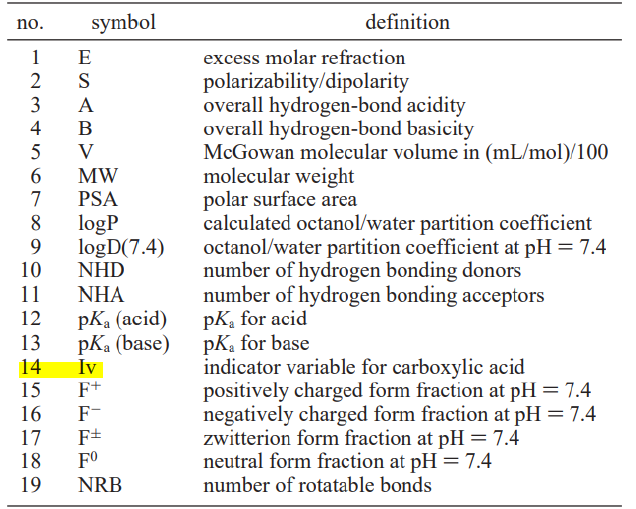

One of the first things I did during my master's @ DataLab was look into the research for Brain-Blood Permeability. I made this repo during the first semester to keep track of the research I did for that topic. 
# BBB
Brain-Blood Barrier permeability prediction

- Features  
The features include 1593 compounds, of which 70% of the instances are training, and the rest are testing.

- Classification (Output)  
BBB+ = 1  
BBB- = 0

- Feature characteristics (Inputs)  
Out of 19 features, 18 are continuous and 1 categorical(highlighted below)

- Feature information  

